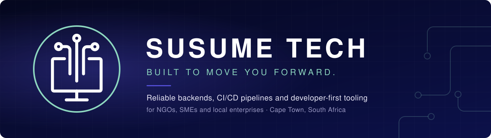
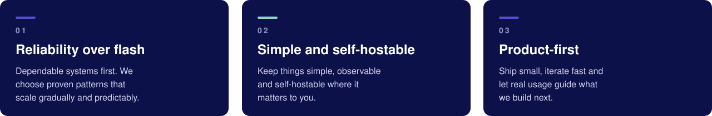
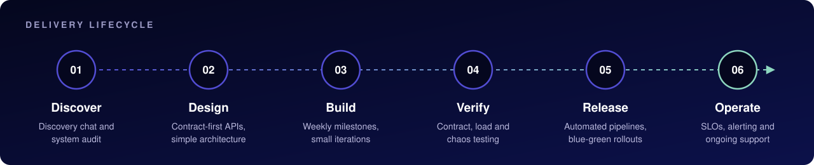

  

  <a href="https://susume.tech"><strong>Website</strong></a>
  &nbsp;&middot;&nbsp;
  <a href="https://susume.tech/#services"><strong>Services</strong></a>
  &nbsp;&middot;&nbsp;
  <a href="https://blog.susume.tech"><strong>Blog</strong></a>
  &nbsp;&middot;&nbsp;
  <a href="mailto:info@susume.tech"><strong>Contact</strong></a>

 

## About

Susume Tech is a small software company based in Cape Town, South Africa, working fully remote. We build robust backend systems, CI/CD pipelines and developer-friendly products for NGOs, SMEs and local enterprises who need dependable systems without the fluff.

**Mission.** To develop innovative, reliable and user-focused software solutions that solve real-world challenges.

**Vision.** To be a leading South African tech innovator and the go-to provider for trustworthy backend tooling and automated deployments.

## What we do

<table>
  <tr>
    <td width="33%" valign="top">
       
      <strong>Web API Development</strong> 
      Secure, observable REST and GraphQL APIs with contract-first design, OAuth2 and JWT authentication, role-based access control and generated documentation.
    </td>
    <td width="33%" valign="top">
       
      <strong>CI/CD and Cloud Deployment</strong> 
      Automated build, test and release pipelines, blue-green and rolling deployments, infrastructure as code and security gates.
    </td>
    <td width="33%" valign="top">
       
      <strong>Migration and Maintenance</strong> 
      Modernise legacy databases, APIs and infrastructure without downtime, backed by SLOs, alerting and ongoing operational support.
    </td>
  </tr>
  <tr>
    <td width="33%" valign="top">
       
      <strong>Developer-first UX</strong> 
      Operator dashboards and task-focused interfaces built for engineers, with minimal JavaScript and fast rendering.
    </td>
    <td width="33%" valign="top">
       
      <strong>Resilient Architecture</strong> 
      Simple, proven patterns that scale safely: service isolation, disaster recovery with tested restores, and capacity planning.
    </td>
    <td width="33%" valign="top">
       
      <strong>Integrated QA</strong> 
      Quality gates in the release train: contract tests to prevent breaking changes, load tests and chaos engineering.
    </td>
  </tr>
</table>

## How we deliver

## Technology

  
  
  
  
  
  
  
  
  

## Team

| Name | Role | Focus |
| :--- | :--- | :--- |
| Ntsako Silence Ndlovu | Co-Founder and CEO | Backend, integration and developer tooling |
| Fumani (Bright) Chauke | Co-Founder | Networking, DevOps and APIs |
| Natasha Mabaire | Co-Founder | Software quality engineering, reliability and performance |

## Work with us

Tell us about your project and we will suggest practical next steps. We reply within one to two business days.

- **Email:** [info@susume.tech](mailto:info@susume.tech)
- **Website:** [susume.tech](https://susume.tech)
- **Location:** Johannesburg, South Africa, remote friendly

&copy; Susume Tech. Built to move you forward.

